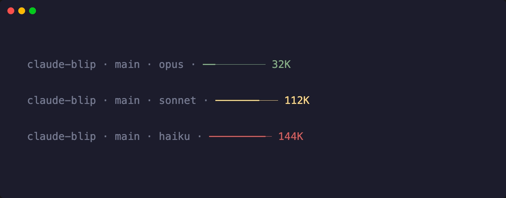

<div align="center">

# claude-blip

**A single-file statusline for Claude Code.**
*Zero dependencies. One command. Just a blip.*

[](https://www.npmjs.com/package/claude-blip)
[](https://packagephobia.com/result?p=claude-blip)
[](LICENSE)



*dim when chill, yellow when warm, red when you should probably wrap up*

</div>

Five segments. No config files. No themes. No plugins.
It just shows you what matters and gets out of the way.

## Install

```sh
npx claude-blip
```

That's it. Restart Claude Code. Done.

## What you get

| Segment | What it shows | Style |
|---------|--------------|-------|
| **Task** | What Claude is working on right now | **bold** |
| **Project** | Directory name | dim |
| **Branch** | Current git branch | dim |
| **Model** | opus, sonnet, haiku | dim |
| **Context** | Usage bar + token count | green → yellow → red |

Everything is dim except the task — your eyes go to the thing that matters.

Terminal too narrow? Segments drop off the left. Context bar always stays.

## Examples

Normal — plenty of room:

```
Fixing auth bug · myapp · main · opus · ━━──────── 40K
```

Getting warm — yellow at 70%:

```
myapp · main · opus · ━━━━━━━─── 140K
```

Running hot — red at 90%, time to wrap up:

```
myapp · main · opus · ━━━━━━━━━─ 180K
```

No task, no git — it adapts:

```
scripts · sonnet · ━━━━──────  80K
```

## Scopes

```sh
npx claude-blip              # global (recommended)
npx claude-blip --project    # .claude/settings.json (shareable with team)
npx claude-blip --local      # .claude/settings.local.json (just you)
npx claude-blip --uninstall  # clean removal from all scopes
```

## How it works

One file. ~150 lines. Node.js only (ships with Claude Code — nothing to install).

Claude Code pipes session JSON to your statusline script via stdin. This script reads it, picks out the useful bits, formats them, writes one line to stdout. That's the whole thing.

The context bar scales to 80% capacity — that's roughly where Claude starts compressing context, so 100% on the bar means "you're about to lose history."

<details>
<summary><strong>Debug mode</strong></summary>

Set `debug: true` in the CONFIG object at top of `statusline.js` to dump the full JSON payload to stderr:

```js
const CONFIG = {
  debug: true,  // logs to stderr
  // ...
};
```

</details>

## Contributing

Found a bug? Want a feature? PRs welcome. Keep it simple — the whole point is one file with zero dependencies.

## License

MIT — do whatever you want with it.

---

<div align="center">

*Built for developers with mass context window anxiety.*

</div>
